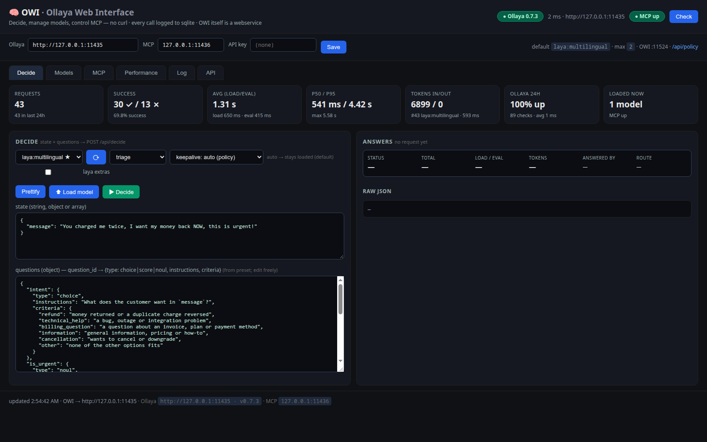
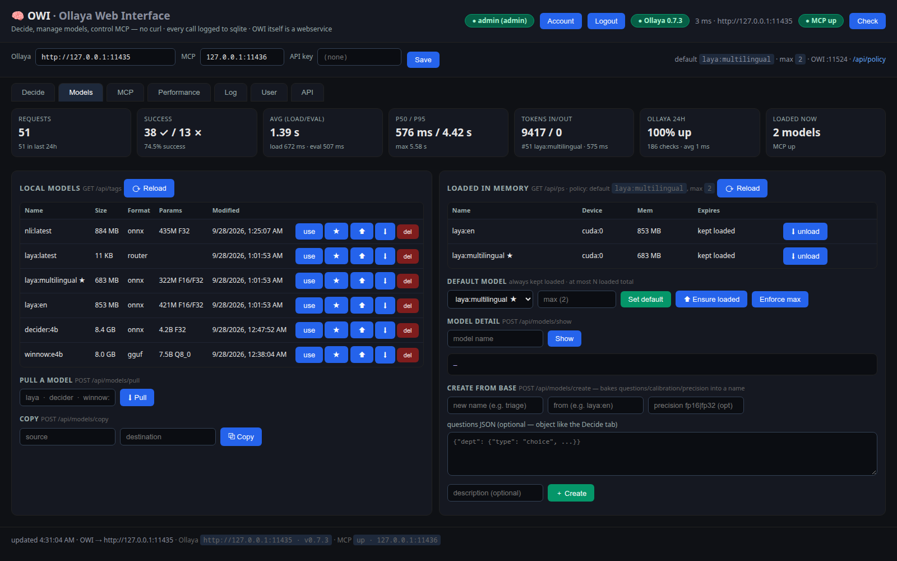
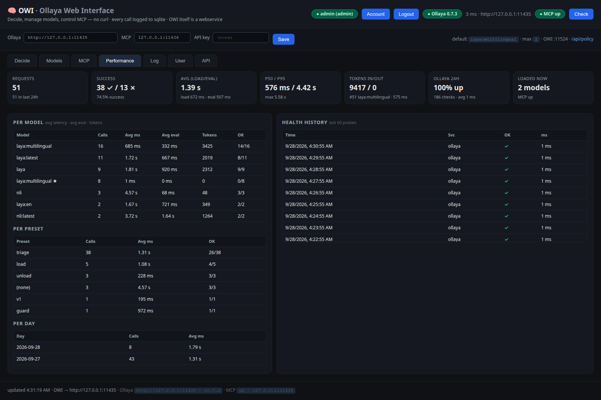
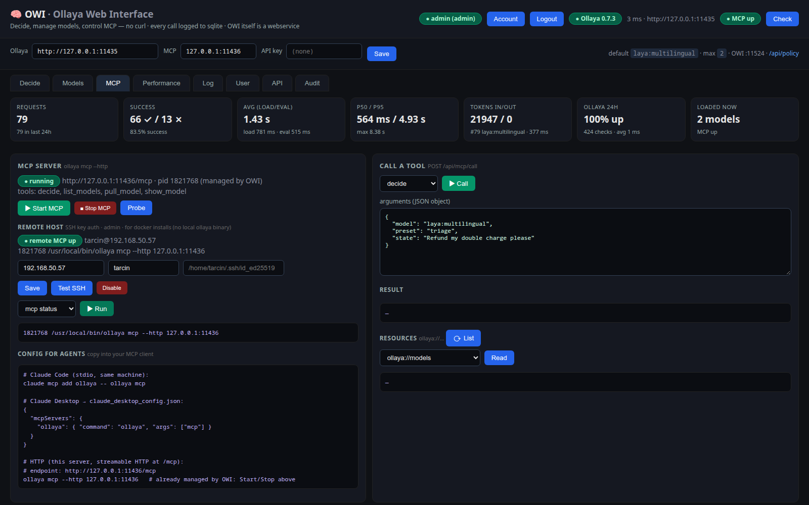
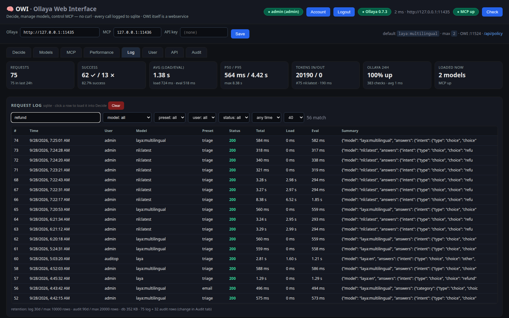
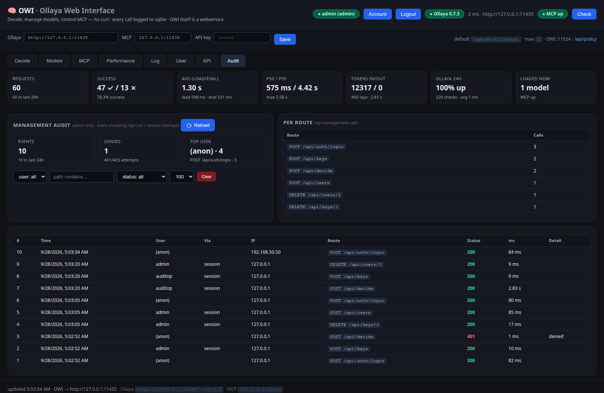

# OWI — Ollaya Web Interface

Web UI + HTTP API in front of the local **[Ollaya](https://ollaya.dev)** server
(`POST /api/decide`, `GET /api/tags`, `GET /api/ps`, `/v1/*`, …)
and its **MCP server** (`ollaya mcp --http`).



## Contents

- [Features](#features)
- [Screenshots](#screenshots)
- [Requirements](#requirements)
- [Installation — pick one path](#installation--pick-one-path)
  - [Prebuilt image (ghcr.io, no clone)](#prebuilt-image-ghcrio-no-clone)
  - [Bare metal (venv + systemd)](#bare-metal-venv--systemd)
  - [Docker (build the image yourself)](#docker-build-the-image-yourself)
- [Configuration](#configuration)
- [Auth quick reference](#auth-quick-reference)
- [API quick reference](#api-quick-reference)
- [Layout](#layout)

## Features

- **Decide playground** — pick a model, a built-in preset
  (`triage`, `email`, `guard`, `moderation`, `router`, `agent`) or your own
  questions; answers with probabilities, load/eval timings, routing info.
- **Model manager** — list local + loaded models, pull / delete / copy /
  create (Modelfile-style), load / unload, default-model keep-alive policy
  (default stays loaded, others unload; max-N-loaded enforcement, GPU-OOM
  CPU fallback).
- **MCP control** — start/stop `ollaya mcp --http` locally, or manage a
  remote Ollaya host over SSH (key auth, allowlisted commands),
  probe health, call tools
  (`decide`, `list_models`, `show_model`, `pull_model`), read resources
  (`ollaya://models`, `ollaya://presets/*`), client config snippets.
- **Users & security** — session login for the UI, bearer API keys for
  scripts, `admin` / `user` roles. Admins manage users; users manage their
  own profile + keys. History and metrics are scoped per user.
- **Performance & log** — totals, p50/p95, per-model/per-preset/per-day,
  Ollaya + MCP health history, searchable sqlite request log
  (full-text + model/preset/user/status/time filters) with retention
  (keep-N-days + max-rows cap, pruned automatically).
- **Full API** — everything the UI does is a `GET/POST /api/*` call
  (route map at `GET /api`, curl examples in the UI's API tab).

## Screenshots

Decide tab (above) plus the other main views:

### Models — local library, loaded in memory, default-model policy



### Performance — per-model / per-preset / per-day, health history



### MCP — local server, remote host, tool calls



### Request log — search, filters, retention



### Audit — admin-only trail of every mutating API call + denied attempts



## Requirements

- [Ollaya](https://ollaya.dev/docs/quickstart) installed and serving
  (default `http://127.0.0.1:11435` — `ollaya serve`, or it starts on demand).
  Tested against **Ollaya 0.7.3** (`/api/*`, `/v1/*`, `mcp --http`).
- Python 3.10+ (bare-metal path only) **or** Docker (docker path only).

---

# Installation — pick one path

> Pick **one** of the three options below — not two on the same host
> (they'd fight over port 11524 and the `./data` sqlite db).

## Prebuilt image (ghcr.io, no clone)

Fastest way to try OWI — no git clone, no build. Published per release at
[ghcr.io/yokurnaz/owi](https://github.com/YOKurnaz/owi/pkgs/container/owi).

> ⚠️ The image is smoke-tested (serves UI, login, decide via host Ollaya)
> but not yet battle-tested in daily use — bare metal remains the
> best-supported path for now.

```bash
mkdir -p data config
curl -s -o config/ollaya-webui.yaml \
  https://raw.githubusercontent.com/YOKurnaz/owi/main/config/ollaya-webui.yaml

# same host as Ollaya (host networking reaches loopback Ollaya):
docker run -d --name ollaya-webui --restart unless-stopped --network host \
  -e OWI_CONFIG=/config/ollaya-webui.yaml \
  -e OWI_DB=/data/owi.db \
  -e OLLAYA_BASE_URL=http://127.0.0.1:11435 \
  -v ./config:/config:ro \
  -v ./data:/data \
  ghcr.io/yokurnaz/owi:0.2.0
# UI: http://<HOST-IP>:11524 (first login: admin / admin)
```

Tags: `:0.1.0` (pinned) or `:latest` (moves with releases).
Same caveats as the Docker path below (MCP, API key, sqlite volume).

## Bare metal (venv + systemd)

> Prefer containers? Install [Docker](#docker-build-the-image-yourself) instead.

```bash
git clone https://github.com/YOKurnaz/owi.git
cd owi
python3 -m venv .venv
.venv/bin/pip install -r requirements.txt
bash run.sh
# UI: http://<HOST-IP>:11524
```

`run.sh` creates the venv on first run, restarts any running instance,
and prints a health check. Or start manually:

```bash
mkdir -p data config
nohup .venv/bin/python src/main.py > data/webui.log 2>&1 &
```

First login is `admin / admin` — change it immediately in the **User** tab.

### Run as a service (systemd user unit, no root)

```bash
mkdir -p ~/.config/systemd/user
cp systemd/ollaya-webui.service ~/.config/systemd/user/
systemctl --user daemon-reload
systemctl --user enable --now ollaya-webui
journalctl --user -u ollaya-webui -f
# UI: http://<HOST-IP>:11524
```

See [`systemd/README.md`](systemd/README.md) for details
(`KillMode=process` keeps a managed MCP child alive across restarts).

---

## Docker (build the image yourself)

> Prefer a venv? Install [Bare metal](#bare-metal-venv--systemd) instead.

The image holds the OWI web UI only — Ollaya itself keeps running on the
host (or wherever `OLLAYA_BASE_URL` points). Steps:

Prebuilt image (each release): `ghcr.io/yokurnaz/owi:0.2.0`
(or `:latest`). Skip to step 2 with `IMAGE=ghcr.io/yokurnaz/owi:0.2.0`.

```bash
git clone https://github.com/YOKurnaz/owi.git
cd owi

# 1. Build the image (name it what you like) — or pull the release image:
# docker pull ghcr.io/yokurnaz/owi:0.2.0
docker build -t ollaya-webui:latest .

# 2. Prepare local dirs (config ships a default yaml; sqlite db, logs and
# saved settings live in ./data and survive image updates)
mkdir -p data config

# 3a. Easiest: compose (port, env, volumes, host-gateway all set).
# NOTE: compose as shipped assumes Ollaya is reachable at
# host.docker.internal:11435 — but Ollaya binds loopback by default
# (see Notes), so prefer --network host (3b) on the same machine,
# or give Ollaya a non-loopback bind first (bridge-networking note below).
docker compose up -d --build
docker compose logs -f ollaya-webui   # Ctrl-C to detach
# UI: http://<HOST-IP>:11524 (first login: admin / admin)

# 3b. Or plain docker run (same thing, explicit). NOTE: with
# --network host the image's baked-in :11524 would clash with a
# bare-metal OWI on the same host — override the command's port:
docker run -d --name ollaya-webui --restart unless-stopped --network host \
  -e OWI_CONFIG=/config/ollaya-webui.yaml \
  -e OWI_DB=/data/owi.db \
  -e OLLAYA_BASE_URL=http://127.0.0.1:11435 \
  -v ./config:/config:ro \
  -v ./data:/data \
  ollaya-webui:latest \
  sh -c "OWI_PORT=11599 exec uvicorn main:app --host 0.0.0.0 --port 11599"
# UI: http://<HOST-IP>:11599
```

Notes:

- Ollaya listens on loopback (`127.0.0.1:11435`) by default, so a container
  reaching it via `host.docker.internal` gets **connection refused** — the
  host gateway (e.g. `172.17.0.1`) is not loopback. Two ways around it:
  - **Same host (simplest):** run the container with host networking
    (`docker run --network host ...`, drop `-p`/`--add-host`), then
    `OLLAYA_BASE_URL=http://127.0.0.1:11435` works from inside.
  - **Bridge networking:** make Ollaya listen off-loopback, e.g.
    `sudo systemctl edit ollaya` with
    `Environment="OLLAYA_HOST=0.0.0.0:11435"` (+ `OLLAYA_API_KEY=...`, since
    it warns when exposed without a key), then `host.docker.internal`
    works as written. If Ollaya runs on another machine, set
    `OLLAYA_BASE_URL=http://<that-host>:11435` instead.
- If Ollaya needs a key (`OLLAYA_API_KEY` set server-side), pass the same
  value as `-e OLLAYA_API_KEY=...` or save it in the UI header.
- MCP start/stop from the UI only works in bare-metal mode (the container
  has no `ollaya` binary). Two alternatives: point `OLLAYA_MCP_ADDR` at a
  host MCP server that is already listening — or configure a **Remote host**
  (MCP tab, admin): host + user + SSH key path, then Test SSH and run
  allowlisted presets (`mcp status/start/stop/log`, `ollaya status/ps`,
  `gpu`). Key auth only, no password stored. Compose vars:
  `OWI_REMOTE_HOST` / `OWI_REMOTE_USER` / `OWI_REMOTE_KEY`
  (+ mount the key into the container, see `compose.yaml`).
- SQLite db, request log and saved settings live in `./data` (a volume),
  so `docker compose pull && docker compose up -d --build` keeps everything.
- Health: the image probes `GET /login` (public); all `/api/*` need login.
  Rebuild after code changes: `docker compose up -d --build`.

---

## Configuration

Lowest priority first — UI settings (sqlite) win over env, env over the
yaml file, yaml over built-ins:

| Setting | Env | YAML key | Default |
|---|---|---|---|
| Ollaya URL | `OLLAYA_BASE_URL` | `ollaya_base_url` | `http://127.0.0.1:11435` |
| Ollaya API key | `OLLAYA_API_KEY` | — (UI only) | unset |
| MCP address | `OLLAYA_MCP_ADDR` | `mcp_addr` | `127.0.0.1:11436` |
| Default model | `OWI_DEFAULT_MODEL` | `default_model` | `laya:latest` |
| Max loaded | `OWI_MAX_LOADED_MODELS` | `max_loaded_models` | `2` |
| Listen port | `OWI_PORT` | — | `11524` |
| Config path | `OWI_CONFIG` | — | `config/ollaya-webui.yaml` |
| DB path | `OWI_DB` | — | `data/owi.db` |

Edit `config/ollaya-webui.yaml`, or change Ollaya URL / MCP address /
API key directly in the UI header (saved to sqlite, no restart).

## Auth quick reference

```bash
B=http://<HOST-IP>:11524

# UI login (session cookie)
curl -s -c jar -X POST $B/api/auth/login \
  -H 'Content-Type: application/json' -d '{"username":"admin","password":"..."}'
curl -s -b jar $B/api/auth/me | python3 -m json.tool

# API key for scripts (shown ONCE)
curl -s -b jar -X POST $B/api/keys \
  -H 'Content-Type: application/json' -d '{"name":"n8n"}'
KEY=owi_...
curl -s $B/api/decide -H "Authorization: Bearer $KEY" \
  -H 'Content-Type: application/json' -d '{
    "model": "laya", "preset": "triage",
    "state": {"message": "You charged me twice, refund NOW!"}
  }' | python3 -m json.tool

# admin: users
curl -s -b jar $B/api/users | python3 -m json.tool
curl -s -b jar -X POST $B/api/users \
  -d '{"username":"ops","password":"...","role":"user"}'
```

## API quick reference

```bash
B=http://<HOST-IP>:11524
curl -s -b jar $B/api/health | python3 -m json.tool
curl -s -b jar $B/api/models | python3 -m json.tool
curl -s -b jar $B/api/policy | python3 -m json.tool
curl -s -b jar -X POST $B/api/mcp/start | python3 -m json.tool
curl -s -b jar $B/api/metrics | python3 -m json.tool
```

Full endpoint list with curl examples is in the UI (§ API) and at
`GET /api` (machine-readable route map, needs login).

## Layout

```
owi/
  requirements.txt
  run.sh                    # venv + start on :11524
  src/main.py               # FastAPI backend
  src/static/               # single-page UI (+ login page)
  systemd/                  # example systemd user unit
  config/ollaya-webui.yaml  # fallback config (UI settings win)
  data/                     # sqlite db (owi.db), mcp.log, webui.log (gitignored)
  docs/                     # GitHub Pages site (screenshot + install steps)
  Dockerfile / compose.yaml # OWI web-UI image (Ollaya stays on the host)
```
